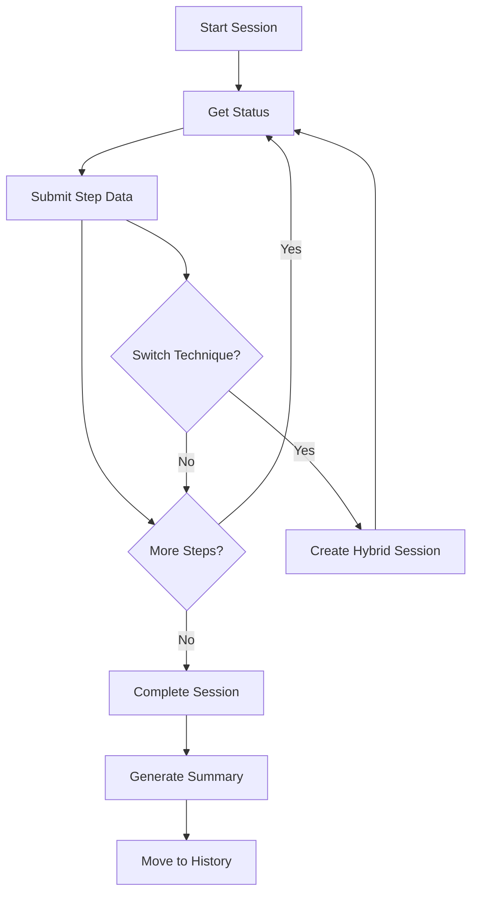

# Structured Creativity Techniques Documentation

**Version:** 1.0  
**Date:** October 24, 2025  
**Project:** Kaleidoscope - Innovation Platform  
**Component:** Structured Creativity Techniques Integration System

---

## Table of Contents

1. [Overview](#overview)
2. [Supported Techniques](#supported-techniques)
3. [Architecture & Design](#architecture--design)
4. [API Reference](#api-reference)
5. [Session Management](#session-management)
6. [Hybrid Approaches](#hybrid-approaches)
7. [Templates & Instructions](#templates--instructions)
8. [Usage Examples](#usage-examples)
9. [Integration Guide](#integration-guide)
10. [Export & Analytics](#export--analytics)

---

## Overview

The **Structured Creativity Techniques** system provides one-click access to proven ideation methodologies with built-in templates, step-by-step guidance, and comprehensive session tracking. This component is designed to facilitate switching and hybridizing creativity methods as needed during innovation sessions.

### Key Features

- ✅ **Three Core Techniques** - Random Word Association, Reverse Brainstorming, Lotus Blossom
- ✅ **Built-in Templates** - Pre-configured workflows with instructions
- ✅ **Session Tracking** - Complete progress monitoring and data capture
- ✅ **Hybrid Approaches** - Seamless technique switching mid-session
- ✅ **Export Capabilities** - JSON, Markdown, and CSV output formats
- ✅ **Team Collaboration** - Multi-participant session support

---

## Supported Techniques

### 1. Random Word Association

**Purpose:** Uses random stimulus words to trigger new associations and breakthrough thinking

**Best For:**
- Breaking out of conventional thinking patterns
- Generating unexpected connections and metaphors
- Quick ideation sessions when stuck

**Duration:** 30-45 minutes  
**Participants:** 1-8 people  
**Steps:** 6 structured phases

**Process Flow:**
1. **Problem Definition** - Clarify the challenge
2. **Random Word Generation** - System provides stimulus word
3. **Association Phase** - 5-minute free association
4. **Connection Mapping** - Identify promising links
5. **Idea Development** - Transform associations into solutions
6. **Evaluation** - Assess and refine concepts

#### Example Session:
```
Problem: "How to improve team productivity?"
Random Word: "BICYCLE"

Associations:
- Bicycle has gears → Teams need different "speeds" for different tasks
- Bicycle balance → Need balance between individual and group work  
- Bicycle chain → Connected workflow where each person's output feeds next

Generated Ideas:
- Gear system: Different meeting types for different energy levels
- Balance dashboard: Visual tool showing individual vs collaborative time
- Chain workflow: Visual pipeline showing task dependencies
```

### 2. Reverse Brainstorming

**Purpose:** Approaches problems by first considering how to cause or worsen them

**Best For:**
- When direct brainstorming isn't productive
- Identifying hidden assumptions and failure modes
- Overcoming mental blocks and resistance

**Duration:** 45-60 minutes  
**Participants:** 3-10 people (optimal: 5-7)  
**Steps:** 6 structured phases

**Process Flow:**
1. **Original Problem** - State the challenge clearly
2. **Problem Reversal** - "How could we make this worse?"
3. **Anti-Solution Generation** - Brainstorm failure modes
4. **Reverse Analysis** - Flip each anti-solution
5. **Solution Synthesis** - Combine reversed ideas
6. **Feasibility Assessment** - Evaluate implementation potential

#### Example Session:
```
Problem: "How to reduce customer complaints?"
Reversed: "How to maximize customer complaints?"

Anti-Solutions:
- Never respond to customer emails
- Make the product impossible to use
- Hide all contact information
- Train staff to be rude and unhelpful

Reversed Solutions:
- Implement 24/7 responsive customer service
- Conduct extensive usability testing
- Make contact info prominent and accessible
- Extensive customer service training program
```

### 3. Lotus Blossom (Rendan-Hōshiki)

**Purpose:** Systematic idea expansion using 8x8 matrix to explore problem dimensions comprehensively

**Best For:**
- Complex, multi-faceted problems
- Comprehensive solution exploration
- Structured team ideation requiring thorough coverage

**Duration:** 60-90 minutes  
**Participants:** 2-12 people (optimal: 4-8)  
**Steps:** 6 structured phases

**Process Flow:**
1. **Core Problem Placement** - Center of main 3x3 grid
2. **Theme Identification** - 8 key problem aspects
3. **Theme Expansion** - Create 3x3 grid for each theme
4. **Connection Mapping** - Find relationships across grids
5. **Solution Clustering** - Group related ideas
6. **Implementation Planning** - Design roadmap for clusters

#### Example Session Structure:
```
Core Problem: "Improve Remote Team Collaboration"

Primary Themes (8):
1. Communication Tools    5. Time Zone Management
2. Trust Building        6. Performance Tracking  
3. Meeting Effectiveness 7. Social Connection
4. Document Sharing      8. Technical Infrastructure

Each theme gets expanded into 8 sub-ideas:

Communication Tools Grid:
- Video conferencing    - Async messaging
- Screen sharing       - Voice notes
- Digital whiteboards  - Real-time editing
- Status indicators    - Integration platforms

[Continue for all 8 themes = 64 total ideas]

Connections Found:
- Status indicators + Performance tracking = Transparent productivity
- Social connection + Trust building = Virtual coffee chats
- Meeting effectiveness + Time zone management = Rotating schedules
```

---

## Architecture & Design

### System Components

```
┌─────────────────────────────────────────────────────────────┐
│            Structured Creativity Techniques                 │
├─────────────────────────────────────────────────────────────┤
│  ┌─────────────┐  ┌─────────────┐  ┌─────────────┐        │
│  │  Session    │  │  Template   │  │  Technique  │        │
│  │  Manager    │  │  Engine     │  │  Executor   │        │
│  └─────────────┘  └─────────────┘  └─────────────┘        │
│                                                             │
│  ┌─────────────┐  ┌─────────────┐  ┌─────────────┐        │
│  │   Export    │  │  Tracking   │  │   Hybrid    │        │
│  │   System    │  │   System    │  │  Switcher   │        │
│  └─────────────┘  └─────────────┘  └─────────────┘        │
└─────────────────────────────────────────────────────────────┘
```

### Core Classes

#### `CreativityTechnique` (Enum)
Defines available technique types:
- `RANDOM_WORD_ASSOCIATION`
- `REVERSE_BRAINSTORMING`  
- `LOTUS_BLOSSOM`

#### `CreativitySession` (DataClass)
Tracks session state and progress:
```python
@dataclass
class CreativitySession:
    session_id: str
    technique: CreativityTechnique
    problem_statement: str
    start_time: datetime
    end_time: Optional[datetime] = None
    participants: List[str] = None
    ideas_generated: List[Dict] = None
    current_step: int = 0
    total_steps: int = 0
    session_data: Dict = None
```

#### `StructuredCreativityTechniques` (Main Class)
Primary interface for all functionality:
- Session management
- Template and instruction provision
- Progress tracking
- Export capabilities
- Hybrid technique switching

---

## API Reference

### Core Methods

#### `start_session(technique, problem_statement, participants=None, session_id=None)`

**Purpose:** Initialize a new creativity technique session

**Parameters:**
- `technique` (CreativityTechnique): Which technique to use
- `problem_statement` (str): The challenge to work on  
- `participants` (List[str], optional): Participant names/IDs
- `session_id` (str, optional): Custom session identifier

**Returns:** `str` - Session ID for tracking

**Example:**
```python
from structured_creativity_techniques import (
    StructuredCreativityTechniques, 
    CreativityTechnique
)

techniques = StructuredCreativityTechniques()

session_id = techniques.start_session(
    technique=CreativityTechnique.RANDOM_WORD_ASSOCIATION,
    problem_statement="How to increase customer satisfaction?",
    participants=["Alice", "Bob", "Charlie"]
)
```

#### `get_session_status(session_id)`

**Purpose:** Get current session progress and next steps

**Returns:**
```python
{
    "session_id": "random_word_association_1234567",
    "technique": "random_word_association",
    "problem_statement": "How to increase customer satisfaction?",
    "current_step": 2,
    "total_steps": 6,
    "progress_percentage": 33.3,
    "current_instruction": "Generate or select a random word",
    "next_action": {
        "action": "random_word_generated",
        "message": "Your random word is: **TELESCOPE**",
        "word": "telescope",
        "questions": [
            "How is 'telescope' similar to your problem?",
            "What properties of 'telescope' could inspire solutions?"
        ]
    },
    "participants": ["Alice", "Bob", "Charlie"],
    "ideas_generated": 3,
    "session_duration_minutes": 12.5
}
```

#### `submit_step_data(session_id, step_data)`

**Purpose:** Submit data for current step and advance to next

**Parameters:**
- `session_id` (str): Session identifier
- `step_data` (Dict): Data collected for current step

**Step Data Examples:**
```python
# Random Word Association - Associations step
step_data = {
    "associations": {
        "telescope magnifies distant objects": "We need to 'zoom in' on customer pain points",
        "telescope requires clear viewing conditions": "Clear feedback channels needed"
    }
}

# Random Word Association - Ideas step  
step_data = {
    "ideas": [
        "Customer pain point magnification tool",
        "Clear feedback channel system",
        "Distant customer outreach program"
    ],
    "participant": "Alice"
}

# Reverse Brainstorming - Anti-solutions step
step_data = {
    "anti_solutions": [
        "Ignore all customer feedback",
        "Make products impossible to use", 
        "Hide customer service contact info"
    ]
}
```

#### `switch_technique(session_id, new_technique, preserve_data=True)`

**Purpose:** Switch to different technique mid-session (hybrid approach)

**Parameters:**
- `session_id` (str): Current session ID
- `new_technique` (CreativityTechnique): Technique to switch to
- `preserve_data` (bool): Whether to preserve generated ideas

**Returns:** `str` - New session ID for hybrid session

**Example:**
```python
# Start with Random Word Association
original_session = techniques.start_session(
    CreativityTechnique.RANDOM_WORD_ASSOCIATION,
    "How to improve team communication?"
)

# Generate some ideas...
techniques.submit_step_data(original_session, {
    "ideas": ["Weekly standup meetings", "Slack integration"]
})

# Switch to Lotus Blossom for comprehensive exploration
hybrid_session = techniques.switch_technique(
    original_session,
    CreativityTechnique.LOTUS_BLOSSOM,
    preserve_data=True
)
```

#### `get_available_techniques()`

**Purpose:** List all available techniques with metadata

**Returns:**
```python
[
    {
        "name": "random_word_association",
        "display_name": "Random Word Association", 
        "overview": "Uses random stimulus words to trigger new associations",
        "duration": "30-45 minutes",
        "participants": "Works with 1-8 people",
        "when_to_use": "When stuck in conventional thinking patterns"
    },
    # ... other techniques
]
```

#### `export_session_data(session_id, format_type="json")`

**Purpose:** Export session data in specified format

**Parameters:**
- `session_id` (str): Session to export
- `format_type` (str): "json", "markdown", or "csv"

**Returns:** `str` - Formatted export data

---

## Session Management

### Session Lifecycle



### Session States

1. **Active** - Currently in progress, stored in `active_sessions`
2. **Completed** - Finished, moved to `session_history`
3. **Hybrid** - Created from technique switch, preserves prior data

### Progress Tracking

Each session tracks:
- **Current Step** - Which phase of the technique
- **Progress Percentage** - Completion status  
- **Ideas Generated** - Count and details of ideas
- **Duration** - Real-time session length
- **Participants** - Active team members

---

## Hybrid Approaches

### Why Hybrid?

Teams often benefit from combining multiple creativity techniques:
- **Sequential Application** - Use techniques in planned sequence
- **Adaptive Switching** - Change based on what's working
- **Complementary Strengths** - Leverage different technique benefits

### Supported Hybrid Patterns

#### 1. **Diverge-Converge Pattern**
```
Random Word Association → Lotus Blossom
(Generate unexpected ideas) → (Organize systematically)
```

#### 2. **Challenge-Explore Pattern**
```
Reverse Brainstorming → Random Word Association
(Identify failure modes) → (Find creative solutions)
```

#### 3. **Systematic-Creative Pattern**  
```
Lotus Blossom → Reverse Brainstorming
(Comprehensive analysis) → (Challenge assumptions)
```

### Implementation Example

```python
def run_hybrid_session():
    techniques = StructuredCreativityTechniques()
    
    # Phase 1: Reverse Brainstorming (identify what NOT to do)
    phase1 = techniques.start_session(
        CreativityTechnique.REVERSE_BRAINSTORMING,
        "How to launch a successful product?",
        ["Product Team"]
    )
    
    # Run through anti-solution generation
    techniques.submit_step_data(phase1, {
        "anti_solutions": [
            "Launch without any testing",
            "Ignore market research completely",
            "Price it at random"
        ]
    })
    
    # Phase 2: Switch to Random Word Association (creative solutions)
    phase2 = techniques.switch_technique(
        phase1, 
        CreativityTechnique.RANDOM_WORD_ASSOCIATION,
        preserve_data=True
    )
    
    # Continue with creative ideation...
    status = techniques.get_session_status(phase2)
    print(f"Now using: {status['technique']}")
    print(f"Ideas preserved from Phase 1: {status['ideas_generated']}")
```

---

## Templates & Instructions

### Template System

Each technique includes pre-built templates with:
- **Step-by-step prompts** 
- **Question frameworks**
- **Example responses**
- **Evaluation criteria**

#### Random Word Association Template
```python
{
    "problem_analysis": "What is the core challenge we're trying to solve?",
    "word_selection": "Random word: {word}",
    "association_prompts": [
        "How is this word similar to our problem?",
        "What properties of this word could inspire solutions?",
        "If our problem was this word, how would we handle it?",
        "What metaphors can we draw between this word and our challenge?"
    ],
    "idea_development": "Develop 3-5 concrete ideas inspired by the associations",
    "evaluation": "Which ideas show the most promise and why?"
}
```

### Instruction System

Comprehensive guidance for each technique:
- **Overview** - What the technique does
- **When to Use** - Optimal scenarios
- **Duration** - Time requirements
- **Participants** - Team size recommendations
- **Steps** - Detailed process breakdown
- **Tips** - Best practices and pitfalls

#### Example Instructions Structure
```python
{
    "overview": "Uses random stimulus words to trigger new associations",
    "when_to_use": "When stuck in conventional thinking patterns", 
    "duration": "30-45 minutes",
    "participants": "Works with 1-8 people",
    "steps": [
        "Clearly define the problem or challenge",
        "Generate or select a random word",
        "Spend 5 minutes freely associating",
        # ... more steps
    ],
    "tips": [
        "Don't judge associations initially - embrace absurdity",
        "Use 'How might...' questions to develop associations",
        # ... more tips
    ]
}
```

---

## Usage Examples

### 1. Complete Random Word Association Session

```python
from structured_creativity_techniques import *

def complete_session_example():
    techniques = StructuredCreativityTechniques()
    
    # Start session
    session_id = techniques.start_session(
        technique=CreativityTechnique.RANDOM_WORD_ASSOCIATION,
        problem_statement="How to reduce employee turnover?",
        participants=["HR Manager", "Team Lead", "Developer"]
    )
    
    # Step through the process
    while True:
        status = techniques.get_session_status(session_id)
        
        print(f"Step {status['current_step']}: {status['current_instruction']}")
        
        # Handle each step type
        if status['current_step'] == 1:  # Problem acknowledgment
            step_data = {"acknowledged": True}
            
        elif status['current_step'] == 2:  # Random word step
            word = status['next_action']['word']
            print(f"Random word: {word}")
            step_data = {"word_received": word}
            
        elif status['current_step'] == 3:  # Association step
            step_data = {
                "associations": {
                    "lighthouse guides ships safely": "We need to guide employees through career paths",
                    "lighthouse stands firm in storms": "Provide stability during organizational changes",
                    "lighthouse beam visible from distance": "Make company values visible to all"
                }
            }
            
        elif status['current_step'] == 4:  # Ideas step
            step_data = {
                "ideas": [
                    "Career lighthouse program: mentorship and clear advancement paths",
                    "Stability beacon: transparent communication during changes", 
                    "Values visibility initiative: daily demonstrations of company culture"
                ],
                "participant": "Team Lead"
            }
            
        elif status['current_step'] == 5:  # Evaluation step
            step_data = {
                "evaluation": {
                    "top_idea": "Career lighthouse program",
                    "reasoning": "Addresses root cause of turnover - lack of growth opportunities",
                    "implementation_feasibility": "High - can start with pilot program"
                }
            }
            
        else:
            break
        
        result = techniques.submit_step_data(session_id, step_data)
        
        if result.get("status") == "completed":
            print("\n🎉 Session completed!")
            print("Summary:", result['summary'])
            break

complete_session_example()
```

### 2. Lotus Blossom Comprehensive Exploration

```python
def lotus_blossom_example():
    techniques = StructuredCreativityTechniques()
    
    session_id = techniques.start_session(
        technique=CreativityTechnique.LOTUS_BLOSSOM,
        problem_statement="How to create a more innovative workplace culture?",
        participants=["Innovation Team", "HR", "Management"]
    )
    
    # Step 1: Acknowledge core problem
    techniques.submit_step_data(session_id, {"acknowledged": True})
    
    # Step 2: Identify 8 primary themes
    themes_data = {
        "themes": [
            "Leadership Support", "Physical Environment", 
            "Reward Systems", "Time Allocation",
            "Team Collaboration", "Learning Opportunities",
            "Risk Tolerance", "External Inspiration"
        ]
    }
    techniques.submit_step_data(session_id, themes_data)
    
    # Step 3: Expand each theme (simplified example)
    theme_grids_data = {
        "theme_grids": {
            "Leadership Support": [
                "Executive innovation challenges", "Innovation time in 1:1s",
                "Leadership innovation training", "Innovation success stories sharing",
                "Protected failure discussions", "Innovation mentorship programs",
                "Cross-department innovation projects", "Innovation budget allocation"
            ],
            "Physical Environment": [
                "Flexible workspace design", "Innovation labs/maker spaces",
                "Collaboration zones", "Inspiration walls",
                "Prototype testing areas", "Quiet reflection spaces", 
                "Technology showcases", "Nature integration"
            ]
            # ... continue for all 8 themes
        }
    }
    techniques.submit_step_data(session_id, theme_grids_data)
    
    # Step 4: Map connections
    connections_data = {
        "connections": [
            {
                "theme1": "Leadership Support",
                "theme2": "Reward Systems", 
                "connection": "Leadership recognition for innovative thinking"
            },
            {
                "theme1": "Physical Environment",
                "theme2": "Team Collaboration",
                "connection": "Collaborative spaces enable cross-team innovation"
            }
        ]
    }
    techniques.submit_step_data(session_id, connections_data)
    
    # Step 5: Create solution clusters
    clusters_data = {
        "solution_clusters": [
            {
                "name": "Innovation Leadership Framework",
                "ideas": ["Executive challenges", "Leadership training", "Mentorship programs"],
                "priority": "High"
            },
            {
                "name": "Physical Innovation Ecosystem", 
                "ideas": ["Flexible workspaces", "Innovation labs", "Collaboration zones"],
                "priority": "Medium"
            }
        ]
    }
    techniques.submit_step_data(session_id, clusters_data)
    
    # Step 6: Implementation planning
    implementation_data = {
        "implementation_plan": {
            "phase_1": "Leadership framework and training (Month 1-2)",
            "phase_2": "Physical environment changes (Month 3-4)", 
            "phase_3": "Reward system integration (Month 5-6)",
            "success_metrics": ["Innovation submissions", "Cross-team projects", "Employee satisfaction"]
        }
    }
    result = techniques.submit_step_data(session_id, implementation_data)
    
    print("Lotus Blossom session completed!")
    print(f"Total ideas generated: {result['summary']['total_ideas_generated']}")

lotus_blossom_example()
```

### 3. Reverse Brainstorming with Solution Development

```python
def reverse_brainstorming_example():
    techniques = StructuredCreativityTechniques()
    
    session_id = techniques.start_session(
        technique=CreativityTechnique.REVERSE_BRAINSTORMING,
        problem_statement="How to improve customer onboarding experience?",
        participants=["UX Designer", "Product Manager", "Customer Success"]
    )
    
    # Step 1: Acknowledge original problem
    techniques.submit_step_data(session_id, {"acknowledged": True})
    
    # Step 2: Problem reversal (automatic)
    status = techniques.get_session_status(session_id)
    print("Reversed problem:", status['next_action']['reversed_problem'])
    
    # Step 3: Generate anti-solutions
    anti_solutions_data = {
        "anti_solutions": [
            "Never explain what the product does",
            "Make signup process as long and confusing as possible",
            "Provide no guidance or tutorials", 
            "Use technical jargon everywhere",
            "Hide important features behind unclear menus",
            "Never respond to customer questions",
            "Make it impossible to contact support",
            "Require complex setup before any value"
        ]
    }
    techniques.submit_step_data(session_id, anti_solutions_data)
    
    # Step 4: Reverse analysis
    reversed_solutions_data = {
        "reversed_solutions": [
            {
                "anti_solution": "Never explain what the product does",
                "reversed": "Provide clear, immediate value proposition explanation"
            },
            {
                "anti_solution": "Make signup process confusing", 
                "reversed": "Design streamlined, intuitive signup flow"
            },
            {
                "anti_solution": "Provide no guidance",
                "reversed": "Comprehensive onboarding tutorials and progressive disclosure"
            }
        ]
    }
    techniques.submit_step_data(session_id, reversed_solutions_data)
    
    # Step 5: Synthesize final solutions
    final_solutions_data = {
        "final_solutions": [
            {
                "solution": "Value-First Onboarding",
                "description": "Show immediate product value before asking for information",
                "implementation": "Interactive demo before signup"
            },
            {
                "solution": "Progressive Onboarding", 
                "description": "Reveal features gradually based on user readiness",
                "implementation": "Smart tutorial system with user progress tracking"
            }
        ]
    }
    techniques.submit_step_data(session_id, final_solutions_data)
    
    # Step 6: Feasibility check
    feasibility_data = {
        "feasibility_assessment": [
            {
                "solution": "Value-First Onboarding",
                "feasibility_score": 9,
                "resources_needed": "Design and development time", 
                "timeline": "2-3 weeks",
                "impact_potential": "High"
            }
        ]
    }
    result = techniques.submit_step_data(session_id, feasibility_data)
    
    print("Reverse brainstorming completed!")
    print("Solutions generated:", len(result['summary']['final_solutions_count']))

reverse_brainstorming_example()
```

---

## Integration Guide

### Flask API Integration

```python
from flask import Flask, request, jsonify
from structured_creativity_techniques import *

app = Flask(__name__)
techniques = StructuredCreativityTechniques()

@app.route('/api/techniques', methods=['GET'])
def get_techniques():
    """List available creativity techniques"""
    return jsonify({
        'techniques': techniques.get_available_techniques()
    })

@app.route('/api/sessions', methods=['POST'])  
def start_session():
    """Start a new creativity session"""
    data = request.json
    
    technique = CreativityTechnique(data['technique'])
    session_id = techniques.start_session(
        technique=technique,
        problem_statement=data['problem_statement'],
        participants=data.get('participants', [])
    )
    
    return jsonify({
        'session_id': session_id,
        'status': techniques.get_session_status(session_id)
    })

@app.route('/api/sessions/<session_id>', methods=['GET'])
def get_session_status(session_id):
    """Get current session status"""
    return jsonify(techniques.get_session_status(session_id))

@app.route('/api/sessions/<session_id>/submit', methods=['POST'])
def submit_step_data(session_id):
    """Submit data for current step"""
    data = request.json
    result = techniques.submit_step_data(session_id, data)
    return jsonify(result)

@app.route('/api/sessions/<session_id>/switch', methods=['POST'])
def switch_technique(session_id):
    """Switch to different technique"""
    data = request.json
    new_technique = CreativityTechnique(data['new_technique'])
    
    hybrid_session = techniques.switch_technique(
        session_id, 
        new_technique,
        preserve_data=data.get('preserve_data', True)
    )
    
    return jsonify({
        'new_session_id': hybrid_session,
        'status': techniques.get_session_status(hybrid_session)
    })

@app.route('/api/sessions/<session_id>/export', methods=['GET'])
def export_session(session_id):
    """Export session data"""
    format_type = request.args.get('format', 'json')
    exported_data = techniques.export_session_data(session_id, format_type)
    
    return Response(
        exported_data,
        mimetype='text/plain' if format_type != 'json' else 'application/json'
    )

if __name__ == '__main__':
    app.run(debug=True)
```

### React Frontend Integration

```javascript
// StructuredCreativityTechniques.js
import React, { useState, useEffect } from 'react';

const StructuredCreativityTechniques = () => {
    const [techniques, setTechniques] = useState([]);
    const [currentSession, setCurrentSession] = useState(null);
    const [sessionStatus, setSessionStatus] = useState(null);

    useEffect(() => {
        fetchAvailableTechniques();
    }, []);

    const fetchAvailableTechniques = async () => {
        const response = await fetch('/api/techniques');
        const data = await response.json();
        setTechniques(data.techniques);
    };

    const startSession = async (technique, problemStatement, participants) => {
        const response = await fetch('/api/sessions', {
            method: 'POST',
            headers: {'Content-Type': 'application/json'},
            body: JSON.stringify({
                technique: technique,
                problem_statement: problemStatement,
                participants: participants
            })
        });
        
        const data = await response.json();
        setCurrentSession(data.session_id);
        setSessionStatus(data.status);
    };

    const submitStepData = async (stepData) => {
        const response = await fetch(`/api/sessions/${currentSession}/submit`, {
            method: 'POST',
            headers: {'Content-Type': 'application/json'},
            body: JSON.stringify(stepData)
        });
        
        const result = await response.json();
        setSessionStatus(result);
        
        if (result.status === 'completed') {
            alert('Session completed! Check the summary for results.');
        }
    };

    const switchTechnique = async (newTechnique) => {
        const response = await fetch(`/api/sessions/${currentSession}/switch`, {
            method: 'POST',
            headers: {'Content-Type': 'application/json'},
            body: JSON.stringify({
                new_technique: newTechnique,
                preserve_data: true
            })
        });
        
        const data = await response.json();
        setCurrentSession(data.new_session_id);
        setSessionStatus(data.status);
    };

    const renderCurrentStep = () => {
        if (!sessionStatus) return null;

        const { current_instruction, next_action, progress_percentage } = sessionStatus;

        return (
            <div className="session-step">
                <div className="progress-bar">
                    <div 
                        className="progress-fill" 
                        style={{ width: `${progress_percentage}%` }}
                    />
                </div>
                
                <h3>Current Step</h3>
                <p>{current_instruction}</p>
                
                {next_action.message && (
                    <div className="action-message">
                        <h4>{next_action.message}</h4>
                    </div>
                )}
                
                {next_action.questions && (
                    <div className="questions">
                        <h4>Consider these questions:</h4>
                        <ul>
                            {next_action.questions.map((question, index) => (
                                <li key={index}>{question}</li>
                            ))}
                        </ul>
                    </div>
                )}
                
                <StepDataForm 
                    stepType={next_action.action}
                    onSubmit={submitStepData}
                />
            </div>
        );
    };

    return (
        <div className="structured-creativity-techniques">
            <h1>Structured Creativity Techniques</h1>
            
            {!currentSession ? (
                <TechniqueSelector 
                    techniques={techniques}
                    onStart={startSession}
                />
            ) : (
                <div>
                    {renderCurrentStep()}
                    
                    <div className="session-controls">
                        <button onClick={() => switchTechnique('lotus_blossom')}>
                            Switch to Lotus Blossom
                        </button>
                        <button onClick={() => switchTechnique('reverse_brainstorming')}>
                            Switch to Reverse Brainstorming
                        </button>
                    </div>
                </div>
            )}
        </div>
    );
};

export default StructuredCreativityTechniques;
```

---

## Export & Analytics

### Export Formats

#### 1. JSON Export
Complete session data with metadata:
```json
{
  "session_info": {
    "session_id": "random_word_association_1234567",
    "technique": "random_word_association", 
    "problem_statement": "How to improve customer retention?",
    "start_time": "2025-10-24T10:30:00",
    "end_time": "2025-10-24T11:15:00",
    "participants": ["Alice", "Bob", "Charlie"],
    "duration_minutes": 45.0
  },
  "ideas_generated": [
    {
      "step": 3,
      "timestamp": "2025-10-24T10:45:00",
      "idea": "Customer lighthouse program for guidance",
      "participant": "Alice"
    }
  ],
  "technique_data": {
    "random_words": ["lighthouse", "bicycle"],
    "associations": {
      "lighthouse guides ships": "Guide customers through product features"
    },
    "selected_ideas": ["Customer lighthouse program", "Navigation system"]
  },
  "summary": {
    "technique_used": "random_word_association",
    "total_ideas_generated": 5,
    "completion_rate": 100
  }
}
```

#### 2. Markdown Export
Formatted report for sharing:
```markdown
# Random Word Association Session Report

## Session Information
- **Session ID:** random_word_association_1234567
- **Technique:** Random Word Association
- **Problem Statement:** How to improve customer retention?
- **Duration:** 45.0 minutes
- **Participants:** Alice, Bob, Charlie
- **Ideas Generated:** 5

## Problem Addressed
How to improve customer retention?

## Ideas Generated
1. **Customer lighthouse program for guidance**
   - Step: 3
   - Participant: Alice

2. **Navigation system for product features**
   - Step: 3  
   - Participant: Bob

## Random Words Used
- lighthouse
- bicycle

## Session Summary
- **Technique Used:** random_word_association
- **Total Ideas Generated:** 5
- **Completion Rate:** 100%
```

#### 3. CSV Export
Simple data format for analysis:
```csv
Idea,Step,Participant,Timestamp
Customer lighthouse program for guidance,3,Alice,2025-10-24T10:45:00
Navigation system for product features,3,Bob,2025-10-24T10:47:00
Bicycle maintenance model for customer care,3,Charlie,2025-10-24T10:50:00
```

### Analytics Capabilities

#### Session Analytics
- **Technique Effectiveness** - Ideas per minute by technique
- **Participation Analysis** - Contribution patterns by participant
- **Progress Tracking** - Step completion times and bottlenecks
- **Idea Quality Metrics** - Feasibility and novelty scoring

#### Cross-Session Insights
- **Technique Preferences** - Which techniques teams use most
- **Hybrid Patterns** - Common technique switching behaviors  
- **Success Indicators** - Completion rates and idea generation
- **Team Dynamics** - Collaboration patterns and engagement

---

## Best Practices & Tips

### Technique Selection Guidelines

#### Use Random Word Association When:
- ✅ Team is stuck in conventional thinking
- ✅ Need quick breakthrough ideas (30-45 minutes)
- ✅ Small group (1-8 people)
- ✅ Looking for unexpected connections

#### Use Reverse Brainstorming When:
- ✅ Direct brainstorming isn't working
- ✅ Need to challenge assumptions
- ✅ Want to identify failure modes
- ✅ Team is too polite/conservative

#### Use Lotus Blossom When:
- ✅ Problem is complex and multi-faceted
- ✅ Need comprehensive exploration
- ✅ Have 60-90 minutes available
- ✅ Want systematic idea generation

### Hybrid Technique Strategies

#### Sequential Combinations
1. **Explore → Focus**
   - Random Word → Lotus Blossom
   - Generate wild ideas, then organize systematically

2. **Challenge → Create**  
   - Reverse Brainstorming → Random Word
   - Identify pitfalls, then find creative solutions

3. **Systematic → Breakthrough**
   - Lotus Blossom → Random Word
   - Comprehensive analysis, then creative leaps

#### Adaptive Switching Triggers
- **Low Energy** - Switch from complex to simple technique
- **Repetitive Ideas** - Try different technique for fresh perspective  
- **Time Constraints** - Move to faster technique
- **Breakthrough Needed** - Switch to Random Word Association

### Facilitation Tips

#### For Remote Teams
- Use breakout rooms for parallel idea generation
- Employ collaborative tools (Miro, Mural) for visual techniques
- Schedule breaks between technique steps
- Ensure all participants have input opportunities

#### For Large Groups
- Split into smaller teams for technique execution
- Rotate facilitators to maintain energy
- Use anonymous idea submission to encourage participation
- Combine individual and group phases

#### For Skeptical Teams  
- Start with Reverse Brainstorming (feels more analytical)
- Explain the science behind creative techniques
- Use business-relevant examples in explanations
- Focus on practical implementation potential

---

## Troubleshooting

### Common Issues & Solutions

#### "No Ideas Generated"
**Symptoms:** Participants struggle to generate ideas
**Solutions:**
- Provide more example associations/connections
- Use multiple random words if first doesn't resonate
- Encourage "bad" ideas to break perfectionism
- Switch techniques if current approach isn't working

#### "Ideas Too Similar"  
**Symptoms:** All generated ideas are variations of same concept
**Solutions:**
- Enforce "no building on others" rule initially
- Use different random words or reversal angles
- Assign different perspectives to participants
- Switch to Lotus Blossom for systematic diversity

#### "Technique Taking Too Long"
**Symptoms:** Sessions exceed planned duration
**Solutions:**
- Set strict timers for each step
- Use simplified versions of techniques
- Switch to faster technique (Random Word Association)
- Focus on quantity over quality initially

#### "Participants Not Engaged"
**Symptoms:** Low participation, minimal contributions
**Solutions:**
- Switch to Reverse Brainstorming (often more engaging)
- Use smaller groups or individual phases
- Make participation anonymous initially
- Provide stronger facilitation prompts

### Technical Issues

#### Session Data Loss
**Prevention:** Regular auto-save of session progress
**Recovery:** Export session data frequently during long sessions

#### Performance with Large Teams
**Optimization:** Split large groups, run parallel sessions
**Management:** Use pagination for idea display

#### Export Failures
**Common Causes:** Invalid session IDs, incomplete sessions
**Solutions:** Validate session status before export attempts

---

## Future Enhancements

### Planned Features

#### 1. AI-Powered Enhancements
- **Smart Word Selection** - AI chooses optimal random words based on problem domain
- **Association Suggestions** - AI provides association prompts when teams are stuck
- **Idea Quality Scoring** - Automated feasibility and novelty assessment

#### 2. Advanced Analytics
- **Technique Effectiveness Prediction** - Recommend best technique for specific problem types
- **Team Compatibility Analysis** - Suggest optimal technique based on team dynamics  
- **Cross-Session Learning** - Learn from successful patterns across sessions

#### 3. Integration Expansions
- **Slack/Teams Bots** - Run techniques directly in communication platforms
- **Miro/Figma Plugins** - Native integration with visual collaboration tools
- **Calendar Integration** - Schedule and run techniques as meeting formats

#### 4. Extended Technique Library
- **SCAMPER Method** - Systematic creative thinking approach
- **Six Thinking Hats** - Perspective-based ideation
- **Morphological Analysis** - Parameter-based solution generation
- **Biomimicry Approach** - Nature-inspired innovation

### Contributing Guidelines

#### Adding New Techniques
1. Implement technique class following existing patterns
2. Create step-by-step template structure
3. Add comprehensive instructions and tips
4. Include example sessions and expected outcomes
5. Test with multiple problem types and team sizes

#### Improving Existing Features
1. Follow existing code style and patterns
2. Maintain backward compatibility for exports
3. Add unit tests for new functionality
4. Update documentation with changes

---

## License & Support

**License:** CC0 (Public Domain) - Part of Project Kaleidoscope  
**Repository:** Integration with main Kaleidoscope platform  
**Support:** xAI Development Team  
**Documentation Version:** 1.0 (October 24, 2025)

---

*This documentation covers the complete Structured Creativity Techniques system, enabling one-click access to proven ideation methods with built-in templates, instructions, and session tracking for Project Kaleidoscope's innovation platform.*